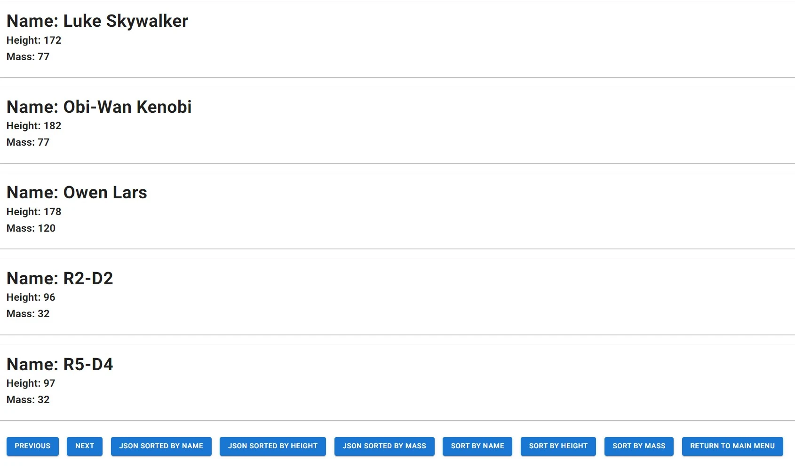
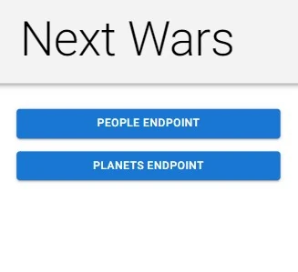
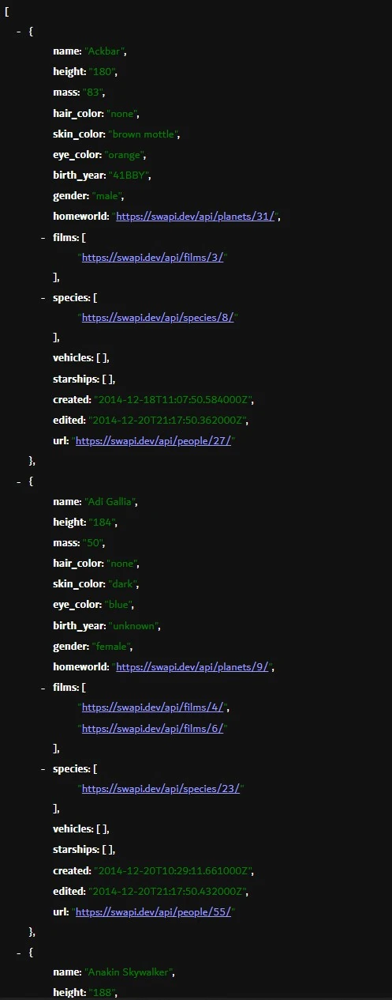
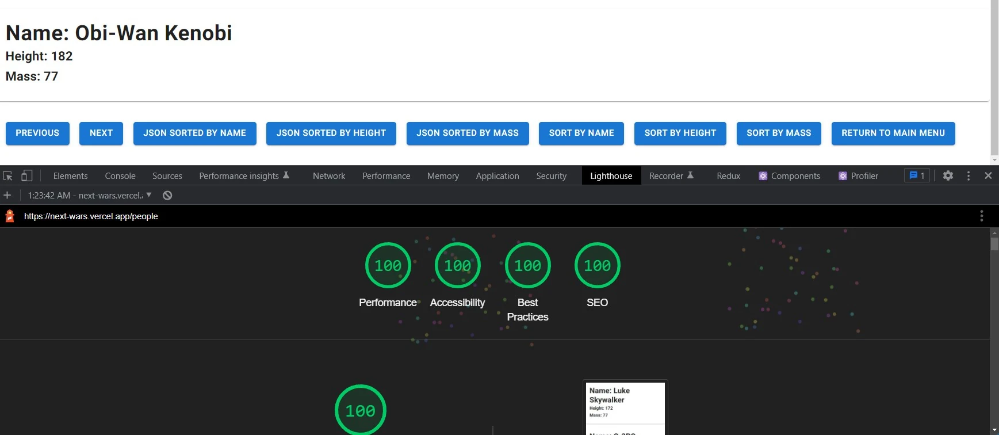

# next-wars

## See the project live [here](https://next-wars.vercel.app/)

This project retrieves data from the Star Wars API and displays the results using Next.js, TypeScript, and MUI. The project is designed around two endpoints. The people endpoint retrieves all people and displays some of their information. The planets endpoint retrieves planet information and swaps certain fields with information from other endpoints. The project allows a user to paginate between the previous and next endpoints to fetch the next set of data. The sorting buttons allow for sorting between name, height, and mass. A button is included to return to the main page. The project currently allows ten people to be retrieved with getStaticProps, and then allows the client to retrieve the next set with client-side fetching. The project may eventually get all people from getStaticProps at build time and implement pagination in another way.

---











## Installation Instructions

1. Clone the repo:

```sh
git clone https://github.com/xiraynedev/next-wars.git
```

2. Change directory:

```sh
cd next-wars
```

3. Install dependencies

```sh
npm i
```

4. Start the dev server:

```sh
npm run dev
```