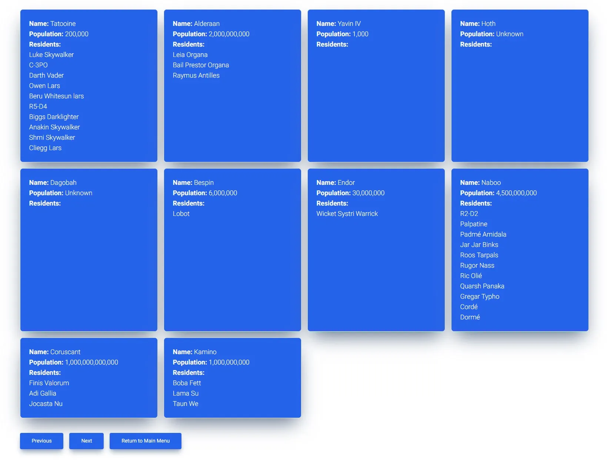

# next-wars

## See the application live [here](https://next-wars.vercel.app/)

Next Wars retrieves data from the Star Wars API and displays the results using Next.js, TypeScript, and MUI. The application was designed around two endpoints. The people endpoint retrieves all people and displays some of their information. The planets endpoint retrieves planet information and replaces the URLs in the residents arrays with the names of the residents.

The application allows users to paginate between the previous and next endpoints to fetch data. The sorting buttons allow for sorting between name, height, and mass. Dedicated JSON buttons are included to fetch directly from the API via the routes /api/people and /api/planets and have been limited to twenty people and planets until the fetching of all information is optimized and cached. Return to main menu buttons are included to return to the main page.

The application currently allows ten people or planets to be retrieved with getStaticProps, and then allows the client to retrieve the next set with client-side fetching while caching the responses with the Cache API. The application may eventually get all data from getStaticProps at build time and implement pagination in another way.

---





## Installation Instructions

1. Clone the repo:

```sh
git clone https://github.com/xiraynedev/next-wars.git
```

2. Change directory:

```sh
cd next-wars
```

3. Install dependencies

```sh
npm i
```

4. Start the dev server:

```sh
npm run dev
```
